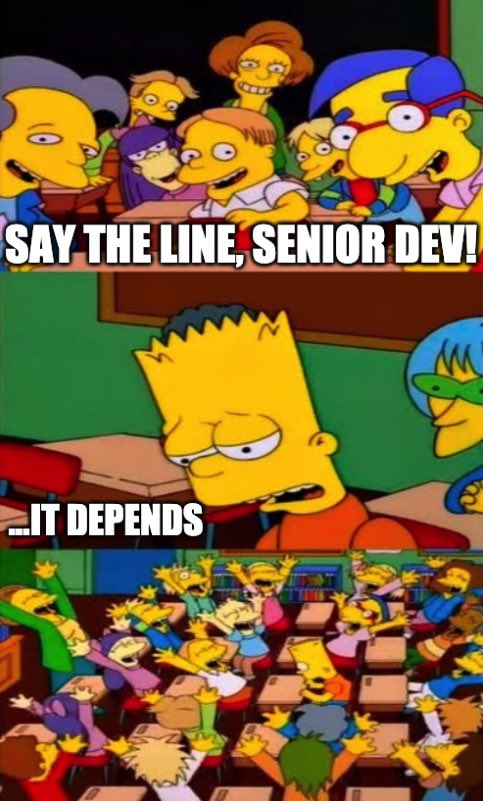
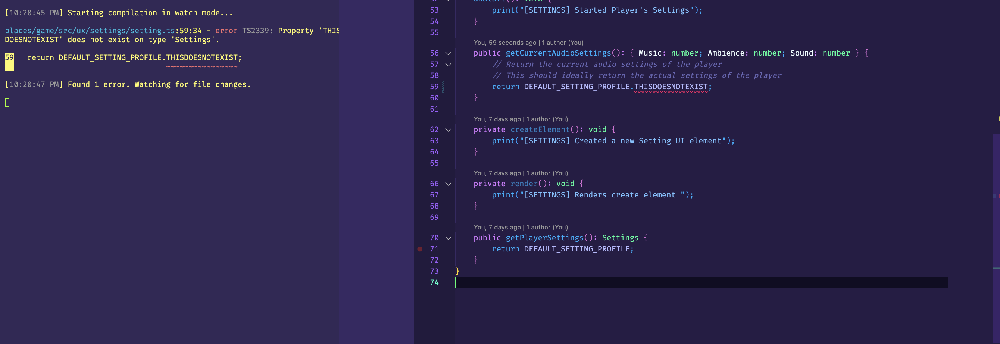

<div style="text-align: center;">
    
</div>

## Hailing From Industry

Javascript, from what I've been cultured, was foreseen to be the programming language of the future. Or that is what my mentors claimed back then. I'm not new when it comes to javascript, in fact, my first exposure to this programming language was 8 years ago! Looking back to my github account, my first commit was a DistanceFormula algorithm, written in Javascript back in 2016. It generated random plot points (x1, y1) and (x2, y2) which then computes the distance between such points.

```javascript
var Plot = [];
var Dis;
function PlotGenerator(min, max) {
	for (i=0; i<4; i++) {
		Plot.push(Math.floor(Math.random() * max) + min);
	}
}

PlotGenerator(1, 10);

//x1, y1, x2, y2
//0,   1,  2,  3
function PythaGorTheroem() {
	var ChangeX = Math.pow(Plot[2] - Plot[0], 2);
	var ChangeY = Math.pow(Plot[3] - Plot[1], 2);
	Dis = Math.round(Math.sqrt(ChangeX + ChangeY));
	console.log("nonrounded : " + Math.sqrt(ChangeX + ChangeY));
}

PythaGorTheroem();

console.log(Plot + " --> distance between two plots is : " + Dis);
```
I was quite a geeky kid back then, so computers was my niche in high school, on, say, the jocks and sports, or nerds and maths. I was obsessed with computers, then led astray to the whole culture of computer sciences, algorithms, programming, and of course - Startups and Silicon Valley when I was young.

Now, hailing from CS industry, my mental models now reign down to adapting to the newest and brightest frameworks of 2024 and beyond. So, learning pure javascript is quite a nostlogic for me, going from the very basics of declaring variables, initializing function signatures, and how to implement the common programming constructs like sequences, selections, and loops. Although, I've been exposed to these concepts a long time ago, I enjoy re-learning the naunces of Javascript, or any programming languages. It shows you how the authors of such languages envision of how programs should be design and constructed, and of course - going from the very archaic languages like LISP, FORTAN, BASIC, etc. and how such authors designed their language based their problems during their times. This usually entails techniques or practices that are long dead or declared bad practices in modern times. This, also entails, Javascript. A language that was once claimed to be the programming language of the future.

# My Thoughts On Javascript

## Typescript > Javascript

Now, I've been exposed to industry CS, and I would say that most software engineers, when building complex and large scale software with hundreds to thousands of engineers like you and me, would often pick a programming language that is naturally aligned to the task in hand. Since most of the modern web systems are inherently complex, this calls for a revamp of JavaScript, which evolutionized to be Typescript, a superset of JavaScript, that is run through a source-to-source compiler. Now, does that imply that all web-related software systems should be written in Typescript?

### It Depends.

Typescript, from what my mentors taught me, enables developer's productivity to blossom as the software system grows larger and larger. Now, going from Javascript to Typescript is a strong entry barrier, and from my personal experiences, I would get a headache attempting to get the code to work, due to its strong emphasis in its typing rules. The strong learning curve is the cost of building a scalable and maintainable software system down the line. Though, that is not to say that one must adopt Typescript for every javascript project, but do a very research of the nature of the project itself, and if Typescript can be much of a better solution than Javascript, and usually the characteristics of industry aligns with the characterisics of Typescript. I would often use Javascript for writing quick and fast hacky scripts.

Even with ES6, the lack of static typing is not ideal in industry. Stability is one of the characteristics that software engineers should strive when building large scale applications, and dynamic typing is not ideal for such vision. When re-learning javascript, I cringed to the idea of not declaring types to my variables, function signatures, and return values. From my experiences, I can see how the accumulation of such code, even though valid, leads to inaccuracies and security vulnerabilities in a large codebase.

Say, for example, implementing a simple multiplication algorithm. Both are valid code and executes properly, but one is very error-prone than the other.

### Written in JavaScript
```javascript
function multiply(a, b) {
  return a * b;
}

console.log(multiply(1, [])) // This will output '0'! A very strange, yet valid behavior in Javascript
```

### Written in Typescript
```typescript
function multiply(a: number, b: number): number {
    return a * b;
}

console.log(multiply(1, [])) // This will, in real time, tell you that your parameters are wrong. [] in not a number.

```
Simple as these concrete examples are, when you design large scale codebase with thousands of functions interacting with each other, you're gonna pray that every function that you or others have written is behaving as expected, otherwise you will have a messy day of debugging that single problem, that could otherwise, been prevented by enforcing a type system.

Another thing I love about Typescript, or say, what I dislike about Javascript, is its error feedback system. Naturally, your javascript code is determined at runtime, that is, you wait and see if there exist an error whilst the system is actively running. This is not necessarily quite a ideal design to have if your software is running to hundreds or millions of users. One of my key characteristics when programming is to have a system in place where it provides real time error feedback of the code you're writing. I love it when my compiler is enganging with my code in real time, even moreso, if with a lint system in place when writing and correcting code in real time. Vanilla Javascript doesn't tap into my programming flow, and usually creates more pain than fun when coding.

<div style="text-align: center;">
    
</div>

As you can see, the transpiler is able to do type checking on the fly while coding in real time. It does this every time you save your code, while, in javascript, you must pray and hope that this function works everytime you manually run your code. I'm certain that somewhere in Human-Computer Interface aspects of programming, this fast feedback system is ideal for developer productivity.

## Atheltic Software Engineering ~= LeetCoding Culture

### Is this good attribute for a competent software engineer?

In academia, I've been encultured by an interesting niche activity that most software engineers that have confront in their professional lives, which in this context, our instructors call these Athletic Software Engineering. I've written various blogs about such culture, including its flaws when hiring a competent software engineer for any type of tech jobs, and as well as my experiences when navigating an internship position in Big Tech. The key premise is that, given a small finite amount of time, generally, fifteen to thirty minutes, you are confronted with an algorithm problem, to such you must provide a solution, generally expected an optimal, optimized implementation of your solution written in your favorite language. Do these enough times succesfully in a tech interview, you're hired. Fail to solve a single problem, you're out of the equation.

### It Depends.

Apart of this Athletic Software Engineering, is the key routine of W.O.Ds. (Workout of The Day), which are short bursts of algorithm questions that we solve in a timely manner. I find any nature of such activities to be a good practice supplement to landing a job in Big Tech. Hence, this style of learning attempts to simulate such process is good exposure to handle a variety of feelings you've often face in the real event. Due to the fact that we are faced with hard algorithm problems, high expectations, and short finite amount of time of completion, such activity is inherently stressful. Sometimes I wonder if this core activity correlates to being a competent software engineer, but all i do know, is that we are thrusted in this process that could determine whether we are broke or finacially stable. I think most software engineers generally do not like this type of activity, but is a requirement for breaking entry to a new tech job, that all techies must do, from new grad role to senior engineer. I suppose a good way of thinking about this is that it's the bitter pill we must swallow to be successful, as in, landing an offer, in any technical industries that follow the leetcoding culture.

I used to be a competitive programmer in my freshmen year of University, so I do find such nature of activities enjoyable if and only if there is no high expectations of making it run successfully. We do it for fun. Algorithms, in general, is still a very interesting field to me, and it's akin to how mathematicians are obsess in solving toy problems is their field of work, or say a physicist modeling and solving toy problems in their free time. Of course, abstracting all the hardware and fancy software frameworks, it all boils down to algorithms and data structures.
