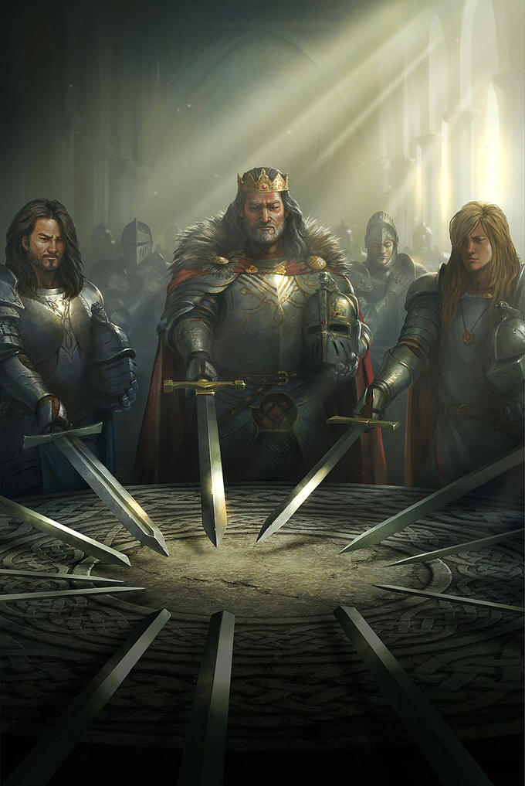

    

### We All Follow an Ethos

In the age-old tales of knights and chivalry, the essence of a true knight was not only defined by prowess in battle but also by their unwavering commitment to a code of honor and duty. This ancient ethos finds a surprising parallel in the modern world of software development, where programmers, much like knights of yore, are bound by a code — the code of coding standards. These standards, akin to the chivalric code, are not merely guidelines but a creed that emphasizes readability, maintainability, and functionality in the realm of programming. Yet, I propose that the true mastery of programming, akin to the knight's journey to knighthood, lies not just in adhering to these standards but in creating and imparting them.

Just as knights were expected to uphold honor and duty, coding standards emphasize readability, maintainability, and functionality in code. With that, programmers adhere to standards written by the architecture, to whom that whoever be. I beleive coding standards does teach you how the certain naunces of a programming languages. But I believe, moreso, that creating the coding standards is more appropriate for learning a programming language. My key reason is that this particular activity requires understanding the sets of bad practices in programming languages, and mitigations of such behaviors by designing your own conventions, and teaching these to your team.

In terms of merely following the coding standards, I suppose the programmer will differentiate between good and bad code, which in itself, is a learning acitvity of understanding programming language lingo. Since there are infinite ways of implementation of such feature, we tend to choose the best path to that feature. And the only way to recognize such path, is to understand the programming language at the inner level.

In the collaborative process of code review, the application of personal conventions that extend beyond the standard coding guidelines set forth in documentation is not just beneficial — it's a hallmark of a strong programmer. This practice is similiar to a craftsman adding their unique signature to a piece of work, elevating it beyond mere functionality. By introducing individual conventions, a programmer demonstrates a deeper understanding and mastery of the language, reflecting a level of expertise that transcends basic compliance with established standards.

### Quest for the Holy Code

Through my experiences, ESLint has always been a pain to integrate for the first time in any coding project. I've come to understand that this initial phase of integrating tools like ESLint is not just a procedural step but a fundamental part of creating high-quality software. The importance of this phase becomes even more pronounced when considering the scale of software deployment and usage. Code developed in modern software projects is not just read and maintained by a handful of people; it is often scrutinized by thousands of developers and reaches millions of users worldwide. In this context, the role of a tool like ESLint transcends beyond mere error checking. It becomes an essential instrument in ensuring that the code is not only functionally sound but also adheres to a set of standards that guarantee readability and maintainability.

Adhering to these standards through tools like ESLint is not merely about enforcing quality. It is about establishing a system that remains maintainable and understandable years down the line. This is crucial in software engineering, where the lifecycle of a product often spans several years, and the codebase undergoes continuous evolution and scaling. Consistent coding standards ensure that as new features are added and old ones are modified, the code remains coherent and accessible to new and existing developers alike.

At its very core, the process of integrating tools like ESLint and upholding coding standards in software development reflects a universal truth: in every discipline, there is an ethos that guides and shapes our actions. Just as knights of ancient era followed a chivalric code that dictated their conduct and defined their legacy, we, software engineers, adhere to a set of principles that ensure the creation of quality, sustainable code. This ethos, though varying in form and application across different fields, is a constant reminder of our commitment to excellence. In software engineering, this commitment translates into practices that not only enhance the immediate functionality of the code but also ensure its enduring relevance and utility. Thus, whether in the age of chivalry or in age of computers, the ethos we follow is a testament to our values and a blueprint for the legacy we aim to build. To adhere to sets of principles while coding, we not only fulfill our immediate responsibilities but also contribute to a larger narrative of craftsmanship and responsible stewardship, continuing the enduring relevance of the ethos in all human endeavors.
