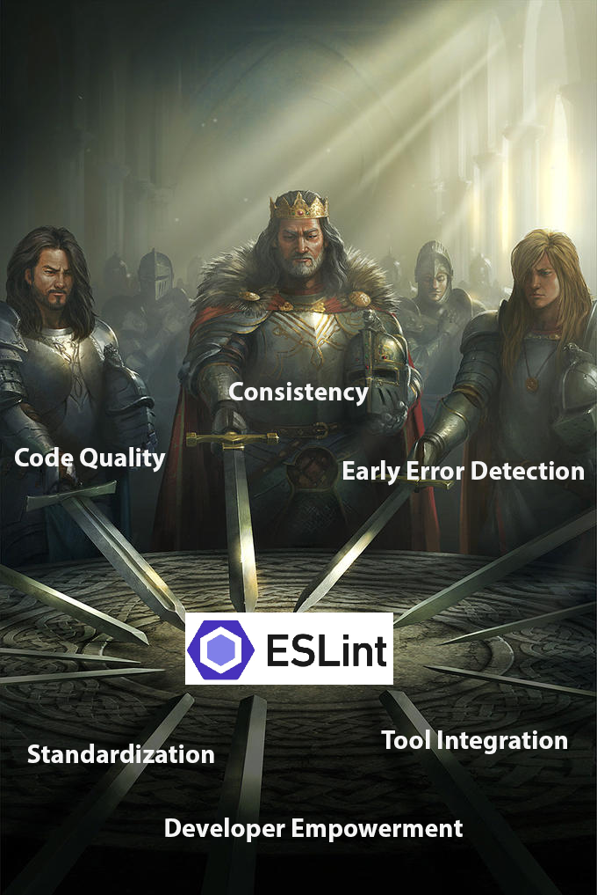

    

### We All Follow an Ethos

We all follow an Ethos. In every walk of life, every profession, and every pursuit, there lies an underlying ethos — a set of standards and principles that guide our actions and define09 our craftsmanship. Intriguingly, these ethos are not rigid laws of the physical universe, bound by the immutable forces of nature. Instead, they are intangible yet powerful constructs, born out of collective wisdom, ethical considerations, and societal expectations. It is not a mere rulebook - It is the an encapsulation of our moral compass, a guiding path of excellence and integrity in whatever respective fields we choose to embark, to adhere to our upmost abilities the moment we start crafting the nature of our work. Take, for instance, the medical profession. A doctor adheres to an ethos encapsulated in the Hippocratic Oath, a timeless pledge that emphasizes the importance of ethics in medicine. Or say, in the age-old tales of knights and chivalry, the essence of a true knight was not only defined by prowess in battle but also by their unwavering commitment to a code of honor and duty.

This universal concept of an ethos, transcending professions and eras, is equally pertinent in the field of software engineering, where programmers, much like knights of yore or our admirable doctors, we too are bound by a code — the code of coding standards.

These standards, akin to the any professional standards, are not just guidelines but a creed for programmers to emphasizes readability, maintainability, and functionality in the codebase. Yet, I propose that the true mastery of programming, much like to a knight's journey to knighthood, lies not just in adhering to these standards but in creating and imparting them. That is, designing and enforcing our very own standards of writing code! Such is born out of collective wisdom, ethical considerations, and societal expectations that requires years of working within the tech industry.

I believe coding standards does teach you how the certain nuances of a programming languages. But I believe, moreso, that creating the coding standards is more appropriate for learning and understanding a programming language. My key reason is that this particular activity requires a deep understanding of the various bad practices that can occur in programming, along with the development of strategies to mitigate such behaviors. By designing your own conventions and imparting these standards to your team, you engage in a comprehensive learning experience. I also believe, within the bounds of learning sciences, that is, learning how to learn, such activity aligns with Bloom's Taxonomy - a thoroughly researched education framework categorizes one's pursuit in mastery of a subject. When you engage in the creation of coding standards, you are not just following rules; you are critically analyzing the language, exploring its limitations, and innovating ways to enhance its use.

In terms of merely following the coding standards, I suppose the programmer will differentiate between good and bad code, which in itself, is a learning acitvity of understanding the expected programming language lingo. Since there are infinite ways of implementation of such feature, we tend to choose the best path to that feature. And the only way to recognize such path, is to understand the programming language at the inner level, balancing optimization and readability of the code we write.

In respect to the collaborative process of code review, where we critique and peer review our fellow programmers, adhering the standard coding guidelines set forth by the codebase, its not just following the rules, it's a hallmark of what defines a competent programmer. It is the demostration of a deeper understanding and mastery of the language, reflecting a level of expertise that transcends basic compliance with established standards.

### Quest for the Holy Code

Through my experiences, ESLint has always been a pain to integrate for the first time in any coding project. I've come to understand that this initial phase of integrating tools like ESLint is not just a procedural step but a fundamental part of creating high-quality software. When I started programming, I started envisioning this personal project that I always wanted to create - a game engine. I was inspired to create an engine that aligned with game design terminology. That way, we can create games while adhering to game design conventions. Yet, I decided to not include ESLint in the beginning phase! Alas, after writing around fifteen thousands lines of code, I began to understand why such coding conventions are important, especially during the debugging and maintanence phase of a software system.

The importance of this phase becomes even more pronounced when considering the scale of software deployment and usage. Code developed in modern software projects is not just read and maintained by a handful of people; it is often scrutinized by thousands of developers and reaches millions of users worldwide. In this context, the role of a tool like ESLint transcends beyond mere error checking. It becomes an crucial instrument in ensuring that the code is not only functionally sound but also adheres to a set of standards that guarantee readability and maintainability as the codebase grows into more than a million lines of code.

Such ethos is important in software engineering, where the lifecycle of a product often spans several years, and the codebase undergoes continuous evolution and scaling. Consistent coding standards ensure that as new features are added and old ones are modified, the code remains coherent and accessible to new and existing developers alike.

At its very core, the process of integrating tools like ESLint and upholding coding standards in software development reflects a universal truth: in every discipline, there is an ethos that guides and shapes our actions. Just as knights of ancient era followed a chivalric code that dictated their conduct and defined their legacy, we, software engineers, adhere to a set of principles that ensure the creation of quality, sustainable code. This ethos, though varying in form and application across different fields, is a constant reminder of our commitment to excellence. In software engineering, this commitment translates into practices that not only enhance the immediate functionality of the code but also ensure its enduring relevance and utility. Thus, whether in the age of chivalry or in age of computers, the ethos we follow is a testament to our values and a blueprint for the legacy we aim to build. To adhere to sets of principles while coding, we not only fulfill our immediate responsibilities but also contribute to a larger narrative of craftsmanship and responsible stewardship, continuing the enduring relevance of the ethos in all human endeavors.
