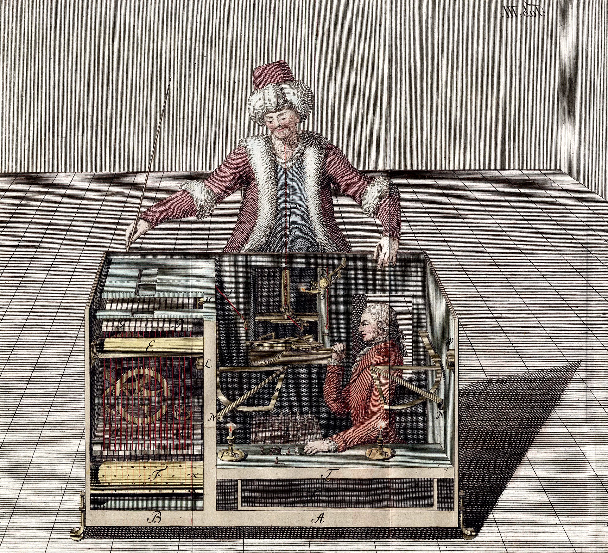

    

### I. Introduction

The role of AI in education, broadly, provides a pivotal point of how we interact and engage with learning materials. AI helps us become more self-directed learners, allowing us to infer through socratic dialogues, whilst also giving us a path to how we engange with materials. Now, specifically for software engineering,
Begin with an introduction to the role of AI in education and its specific relevance to Software Engineering. Present an overview of the key concepts or tools related to AI that you have used generally and in ICS 314. Mention which AI tools you have made use of e.g. ChatGPT, Bard, Co-Pilot

### II. Personal Experience with AI:
I have used AI in class this semester in the following areas:

  1. Experience WODs e.g. E18

  2. In-class Practice WODs

  3. In-class WODs

  4. Essays

  5. Final project

  6. Learning a concept / tutorial

  7. Answering a question in class or in Discord

  8. Asking or answering a smart-question

  9. Coding example e.g. “give an example of using Underscore .pluck”

  10. Explaining code

  11. Writing code

  12. Documenting code

  13. Quality assurance

  14. Other uses in ICS 314 not listed above

### III. Impact on Learning and Understanding:

### IV. Practical Applications:

### V. Challenges and Opportunities:

### VI. Comparative Analysis:

### VII. Future Considerations:

### VIII. Conclusion:
