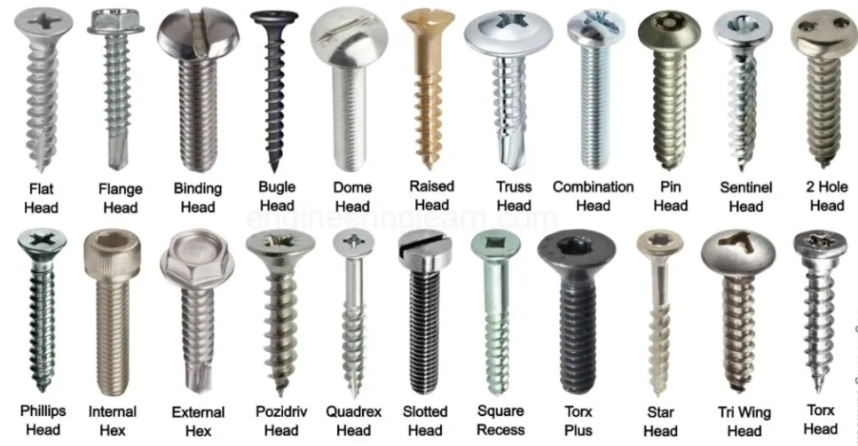

<div style="text-align: center;">
    
</div>

Imagine an engineer working on various projects, each requiring the assembly of parts in some way. The screw becomes a fundamental tool, adapting to different needs—whether securing a delicate component in a watch or bolting together heavy machinery. Despite the wide uses found in every physical engineering project, the screw acts as a language: its fundamental design—a helical ridge wrapped around a cylindrical shaft—remains constant, but it can be customized in size, material, and head type to suit different project requirements. This allows the engineer to efficiently solve a common structural design problems, demonstrating how a foundational design can be adapted for broad, versatile use without needing reinvention for each new project.

This versatile screw has become an adaptable tool in every structure of engineering, serving as a template adapted to a variety of design problems without the constant need of reinvention.

So - what are the 'screws' for other professions ? It turns out, these screws are called 'design patterns.'

### A Brief Historical Context

By definition, a design pattern is a general repeatable solution to a commonly occurring problem in software design [[1]](https://sourcemaking.com/design_patterns). It acts as a mere template for how to solve a problem that can be used in many different situations, as programmers realized that problems you are dealing with, more or less, similiar to problems that are general problems in software functionality. Though, that is to say, a design pattern isn't a finished copy-paste code that can magically fit into your code system, but rather, a description or template for how to solve a commonly re-occurring software problem that can be used in many different situations, just like a screw.

In fact, the concept of design pattern was established outside of computer sciences. It was first prominently outlined by Christopher Alexander, an architect and design theorist, in his 1977 book "A Pattern Language." Alexander described patterns as a methodical approach to address recurring problems in urban design, architecture, and community living.

In architecture, a design pattern might address the optimal layout for residential housing to foster community interaction or efficient ways to bring natural light into buildings. Each pattern provides a solution that can be used in many designs, helping architects and urban planners solve specific design challenges without needing to reinvent solutions.

**Now do you see the connection?**

Design patterns are merely just heuristics for design problems, allowing the designer to solve design problems that are commonly found and establishly built. Design pattenrs can be found anywhere in any particular domain, in writing and the many structure on engineering a story (e.g, The Hero's Journey), Arhcitecture and Urban Planning (e.g. A Place to Wait - 'every building needs a waiting room!'), and even in video game design (i.e, Chris Barney's Pattern Language for Game Design and design problems for making a quality game) [[2]](https://patternlanguageforgamedesign.com/)

Naturally, this method of problem-solving was propogated into programming and software architecutre, creating technical solutions to commonly found software architectural design problems in every software systems. In fact, the first formal reference was Design Patterns: Elements of Reusable Object-Oriented Software, a 1994 book that discusses 23 design patterns specifically tailored for object-oriented programming. For computer-science lore related, these were constructed by Erich Gamma, Richard Helm, Ralph Johnson, or known as the Gang of Four, as they are effecitively formalized a set of design patterns that address common design challenges in software development that are still in use as of today.

Naturally, our industry moves quickly as to how software iterates rapidly, and some may perceive these knowledge as ancient and out of touch compared to many frameworks and methodologies that we've often use today. In fact, most frameworks often have built-in support for these patterns, allowing developers to benefit from them without having to implement them explicitly (e.g.,the Model-View-Controller (MVC) pattern is often found in in many web development frameworks, like React and Angular)! You may have already used a design pattern without explicity engineering them.

### My Experieneces

I'd seperate my two experiences of Design Patterns into two fields of software I've dabbled the most - Web Development and Game Development. Each field of work dabbles different functionality of software systems, but each contain similiar programming designs that can be adapted any software systems.

### The Time I created A Survey App

One thing, that all web apps are naturally designed, is that it's very event-driven. You do some thing around the app, and the system changes and adapts to whatever the user's goals and motivation. I remember the first time designing a web app using default HTML, CSS, Javascript, I had a system that without utilizing any advanced state management or observer patterns. The setup typically involves directly manipulating the DOM (Document Object Model) based on user interactions. Happily I was to get it working, as the complexity of user interactions increases (e.g., conditional questions based on previous answers, real-time feedback on inputs), I had to manually managing these through direct DOM manipulations! Hence, limiting developer productivity.

 If I could re-engineer such software systems with the knowledge I have today, I would utilize a Framework that utilizes a design pattern that observes changes in the component's state re-render the component when any of these changes occur.React, for instance, has a built-in mechanism to observe changes in the component's state or props and re-render the component when any of these changes occur. This is a form of the Observer pattern where the React components act as observers to their own state or props!

To be more precise, React’s emobides Observer pattern through useState, managing states locally within components and useContext for more complex state that needs to be shared across multiple component, effecitvely eliminating direct DOM manipulations, instead using a declarative style where you describe the UI as a function of state!

### Or the time, I created an AI System for my games

Another use of designs patterns throughout my adventures in software engineering, and more explicitly engineered, was the time I created an AI System for my games. In gameplay engineering, we've often design various managers systems within our game, ResourceManager would handle the initialization and uses of all resources within our game, AudioManager would read through all the sound files defined in my audio folders and play them accordingly within my game, UIManager would handle the transitions of UIs from my game, from start menu to real time cutscenes for my players. Of course, AIManager would handle the creation and behavior of all my AI agents in my game, collectively swaming intelligence.

Yet, everytime I initialize an AI Agent, say an enemy monster, it initalizes its own AIManager, and not doing as I wanted - collectively sharing information between all enemy monsters. Here was an example problem of what I was facing:

```typescript
// AIManager.ts
export class AIManager {
    // Tracks the number of enemies spawned for this instance
    private enemyCount: number = 0;

    constructor() {
        print("AIManager instance created");
    }

    public spawnEnemy(enemyType: string): void {
        this.enemyCount++;
        print(`Enemy spawned: ${enemyType}. Total enemies for this instance: ${this.enemyCount}`);
    }

    public getEnemyCount(): number {
        return this.enemyCount;
    }
}

// Usage in game script
import { AIManager } from "./AIManager";

let aiManager1 = new AIManager();
aiManager1.spawnEnemy("Zombie");

let aiManager2 = new AIManager();
aiManager2.spawnEnemy("Skeleton");

// Will print 1
print(`Total enemies spawned by aiManager1: ${aiManager1.getEnemyCount()}`);
// Will also print 1
print(`Total enemies spawned by aiManager2: ${aiManager2.getEnemyCount()}`);

// How can ever print out all enemy count!

```
Notice that since each enemy has its own AIManager, efficitviely always printing out `1` in the `getEnemyCount()` method. The expected output should be `2` because we have a Zombie and Skeleton enemy.

How would I go about creating a single, universal AI system that can be used to communicate and share data for all my agens? Such as an enemy counter? Or, more generally, how do we address the common design challenge in software architectures of ensuring that distributed parts of a system can interact with and update a shared state in a consistent and efficient manner?

#### A Singleton Design pattern!

This is useful in cases where exactly one object is needed to coordinate actions across the system. The pattern ensures that a class has only one instance and provides a global point of access to it. Now here's how we would adjust our AIManager with a Singleton Design Pattern

```typescript
// SingletonAIManager.ts
export class SingletonAIManager {

    private static instance: SingletonAIManager | null = null;
    // Tracks the number of enemies spawned
    private enemyCount: number = 0;

    private constructor() {
        print("Singleton AIManager instance created");
    }

    public static getInstance(): SingletonAIManager {
        if (!this.instance) {
            this.instance = new SingletonAIManager();
        }
        return this.instance;
    }

    public spawnEnemy(enemyType: string): void {
        this.enemyCount++;
        print(`Enemy spawned: ${enemyType}. Total enemies: ${this.enemyCount}`);
    }

    public getEnemyCount(): number {
        return this.enemyCount;
    }
}

// And how we would call our SingletonAIManager
import { SingletonAIManager } from "./SingletonAIManager";

let aiManager = SingletonAIManager.getInstance();
aiManager.spawnEnemy("Zombie");

let sameAiManager = SingletonAIManager.getInstance();
sameAiManager.spawnEnemy("Skeleton");

print(`Total enemies spawned: ${aiManager.getEnemyCount()}`);
// This will print the total count of enemies, which is 2!

```

### Deconstructing the Singleton Design Pattern

This Singleton design pattern solves this by ensuring that there is only one instance of SingletonAIManager across the entire system. This single instance manages a centralized enemy count, which means that all enemy spawns, regardless of where or when they are triggered in the game, increment the same counter. The core design pattern template are how we define our constructor, a variable, and a method - the three main components that defines a Singleton.

### Private Constructor
```typescript
private constructor() {
    print("Singleton AIManager instance created");
}
```
This prevents external code from creating new instances of the Singleton class directly. Instead, instances can only be created within the class itself.

### Static Instance Variable
```typescript
private static instance: SingletonAIManager | null = null;
```
This static variable holds the single instance of the class. It's static, meaning it belongs to the class rather than any individual instance, ensuring that it is shared and accessible globally.


### Public Static getInstance Method:
```typescript
public static getInstance(): SingletonAIManager {
    if (!this.instance) {
        this.instance = new SingletonAIManager();
    }
    return this.instance;
}
```
This method provides the global access point to the Singleton instance. It checks if the instance already exists; if not, it creates it by calling the private constructor. This method ensures that the same instance is returned every time, maintaining the singleton property.

Together, these components ensure that SingletonAIManager is instantiated only once, and its single instance is reused across the entire game! Now all of my AI Enemies can communicate together to destory the common enemy - the Player! All thanks to the Singleton Design Pattern that i've engineered explicity in my game codebase.

## The Ultimate Design Pattern

In my article I've wrote - ["It Depends"](https://caslabs.github.io/essays/it-depends.html), which I emphasize that not every solution are not universally applicable to every problem, but rather - knowing when to apply them is knowing the system itself [[3]](https://caslabs.github.io/essays/it-depends.html), design patterns share the same dillemna.

The true mastery in utilizing design patterns lies not only in understanding and implementing them but in discerning when and when not to use them. Hence the ultimate design pattern that every programmer should learn is the strategic and judicious use of any design pattern. In some scenarios, applying a design pattern might introduce unnecessary complexity or inefficiency. Not every design must be a design pattern. There could be a better, elegant system beyond the 23 design patterns. Moreover, excessive reliance on any single pattern can hinder the flexibility of the system by coupling its components too tightly or reducing their modularity.

Thus, the ultimate design pattern is doing thoughtful analysis of the problem at hand, consideration of the software's future growth, and a deep understanding of the pattern's benefits and drawbacks. Knowing the systems entirely, and balancing when to employ a design pattern and when to seek alternative solutions, developers can craft robust, efficient, and adaptable software architectures.

Note: ChatGPT assisted with the basic code sample of Singleton and Non Singletons AIManager code, and a brief explanation what defines a Singleton design pattern.
