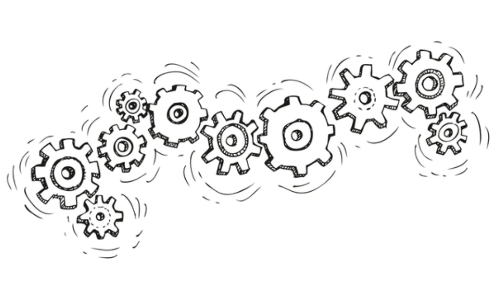

    

Software engineering is a complex system with many different components that define a software product. When I was a boy, I used to watch my father, an engineer, meticulously piece together lines of components that seemed like alien to me. He likened the process to orchestrating a symphony, where every note had to harmonize perfectly with others to create a elegant performance.

I've come to realize that everything around us is a system, a string of complexity, and we can define software systems in the same way. This symphonic approach extends to the entire software development ecosystem, involving a diverse group of stakeholders: from the visionaries who oversee the product’s overall direction to the developers who craft the technical details, and the users who provide essential feedback. This generates an ecosystem called software engineering, where collaboration and standards play crucial roles in ensuring the successful delivery of software solutions. Within this system, certain practices and methodologies help streamline processes and enhance product quality, including Coding Standards, Agile Project Management, and the use of Design Patterns.

### Coding Standards

Coding standards are established guidelines that developers follow to ensure that their code is readable, maintainable, and consistent across a codebase. I've come to realize that such is an ethos akin to any ethos followed by any professions, much like the principles that guide architects in building safe and aesthetically pleasing structures or the protocols that doctors adhere to for ensuring patient safety. They are crucial because they promote code quality and simplify collaboration, as they enable developers to understand and modify each other’s code more efficiently.

Applying the principle of coding standards beyond software development, similar standards or best practices could greatly benefit any collaborative pipeline. For instance, in academic writing, adhering to specific citation styles and editorial guidelines ensures consistency and clarity, which facilitates peer review and academic discussion. Similarly, in collaborative design projects, standards can ensure consistency and quality in outputs, whether in digital design or architecture, by defining clear guidelines on design elements like layout, color usage, and typography.  We adhere to these standards as professions not merely to maintain order of our crafts, but to maintain excellence, ensuring that it communicates effectively and meets rigorous standards of quality and functionality, which is a byproduct of disciplined creativity and structured innovation.

### Agile Project Management

I remember when I had chaos brewing —my first hackathon as a teenager. The event was bustling with energy, screens flickering with code, and competitors huddled in clusters, their faces lit by the glow of their laptops. We were a ragtag team of high school friends, inexperienced but driven by a raw passion for technology. The challenge was daunting, the competition fierce, and the clock was our biggest adversary. Halfway through, overwhelmed by the chaos, we realized the need for a structured approach. Drawing inspiration from a methodology I had read about—Agile Project Management—we decided to pivot.

Agile Project Management is a methodology centered around the core principles of iterative development, flexibility, customer feedback, and continuous improvement. This approach allows teams to adapt to changing project requirements and deliver products that better meet customer needs through regular increments. This is merely but a methology of software engineering processes, and within this, there exist methodologies, such as Agile, including Scrum, which focuses on short "sprints" to achieve specific goals; Kanban, which emphasizes continuous delivery and efficiency; and Lean, which seeks to optimize resource efficiency and minimize waste.

In the end, it was our ability to organize and strategically work as a team that led us to victory. We had turned our chaotic start into a systematic and strategic triumph. That hackathon gave us the first taste of success but also instilled in me a profound appreciation for the power of Agile methodologies in turning ideas into reality.

In fact, this approach, being naturally flexible and adaptive makes it suitable for all kinds of application in non-software projects. For example, in Research & Development, the Agile methodology can be adapted to manage complex, evolving projects where initial hypotheses may shift based on findings. By breaking the research into iterative cycles, researchers can regularly evaluate their approach, integrate new data, and refine their methods, ensuring that the research remains relevant and robust. It signals that Agile Project Management transcends its origins in software development, as its core principles of flexibility, iterative progress, and responsiveness to feedback make it an ideal framework for managing any type of project.

### Design Patterns

I remember the weekend mornings spent in the garage with my father, where the scent of sawdust filled the air and the sound of his old workbench creaked under the weight of numerous tools. He was an driver by profession, and in the quiet corners of our home, he was a passionate woodworker, a craftsman. As a child, I often watched him sketch out designs for new projects—a bookshelf for my room, a birdhouse for the garden, or a custom frame for family photos. He explained to me, much akin to what I've learned in software engineering, there exists patterns that provide standardized solutions to recurring problems, as woodworking, as my father concluded, had its own set of patterns.

Design patterns are standardized solutions to common design problems. They provide a templated method to solve issues that occur frequently within a domain, and in our case, software development, facilitating code reuse and reducing errors through battle-tested architecture. Examples of design patterns include the Singleton pattern, which ensures that a class has only one instance and provides a global point of access to it; the Factory pattern, which offers a way to create objects without specifying the exact classes of objects that will be created; and the Observer pattern, which is used to subscribe and notify multiple objects about any events that happen to the object they’re observing.

## A Holisitc Perspective

As a boy, I used to watch my father piece together intricate systems of wires and wood in our garage, each component carefully selected and assembled to serve a specific function. This exposure to the precision required in engineering projects instilled in me an appreciation for structured methodologies and the importance of every single element in a system, be it a natural or artifical.

This understanding blossomed as I grew, revealing that systems, whether biological ecosystems, mathematical models, or engineered networks, all follow similar patterns of complexity and interdependence. Just as an ecosystem relies on the balance and interaction between its organisms, software systems require various components to work harmoniously to function effectively. Together, these practices demonstrate how software engineering integrates diverse skills and disciplines, fostering a productive environment where complex software systems can be developed, managed, and delivered effectively. They highlight the interconnectedness of the roles within the software engineering ecosystem, where each component, from coding standards to management methodologies, contributes to the overarching goal of creating robust, efficient, and user-centric software products.

Thus, my childhood observations of my father’s obesssion of craft encoded a fundamental lesson in my mind: systems, whether crafted by human hands or by nature, thrive on a foundation of order. This lesson propogated to my approach to software engineering, reminding me that our creations are not just about assembling code; they are about understanding and harnessing the principles that govern all complex systems.
