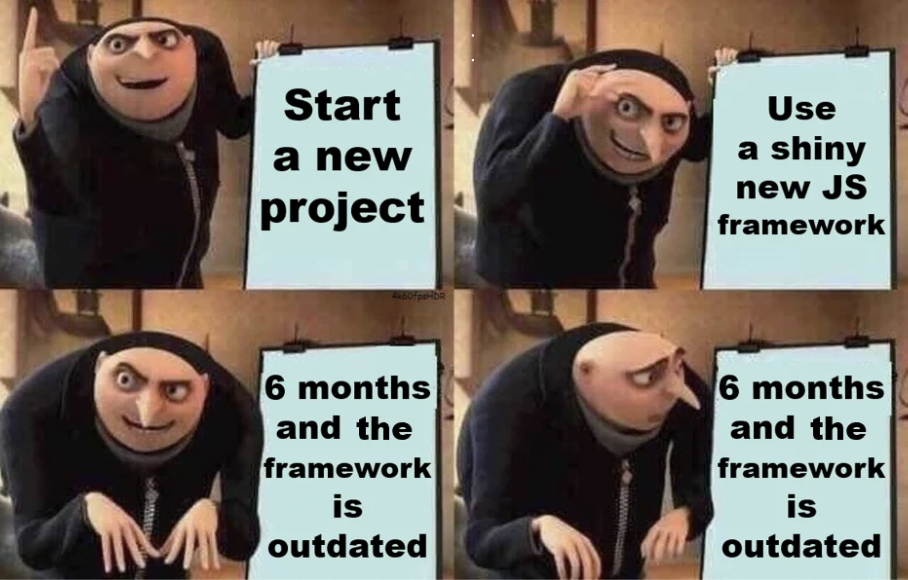

    

### Why Bother?

Why bother to wield a tool, when the hands alone can shape and create? Why bother only on the hands, when tools can achieve precision and complexity beyond the reach of fingers? Why bother to seek the path of wheel technology, when the legs alone can carry us? Why bother to limit oneself to the bounds of natural ability, when tools can unlock new realms of efficiency?

*Why bother with anything less than a framework like Bootstrap 5?*

As you can generalize, we alone design tools for efficiency. Bootstrap 5, is no different than a tool that replaces the hands alone to which create and shape. Thinking beyond the realm of software frameworks, tools are what defines on what makes us humans. We are, of course, a species that design and crafts tools to our advantage. Even though, there exist animals that inherent such ability, what makes us more uniqe - is the ability to create advance tools - such as, but not limiting too, software frameworks.

We use frameworks to produce at an optimal rate, with concrete implementations prior to the main development of such project. It is the accumulation of technical ideas that was implemented prior, in such that, in the future, developers are able to grab that wisdom to their own projects, without the hassle of building things from scratch.

Now, raw HTML and CSS can be analogize to our pure hands. Indeed, such tools are merely principles or atoms that we can potentially use to design our projects. Yet, the most inefficent due its purity. Bootstrap 5, or any HTML/CSS Frameworks are meant to create more features and accessbility for HTML/CSS.

Software engineering benefits greatly of UI frameworks. In fact, any frameworks from any community, within the open source or closed source communities. We use frameworks, and one day - you might desing a framework yourself given a project in any nature of technical project - beyond web development
