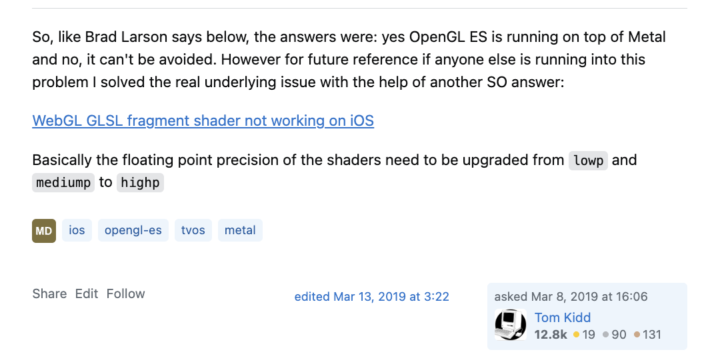
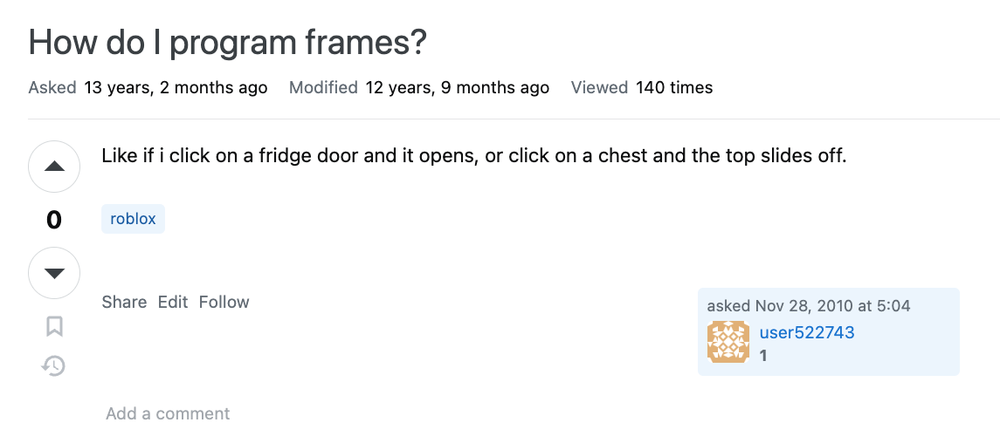
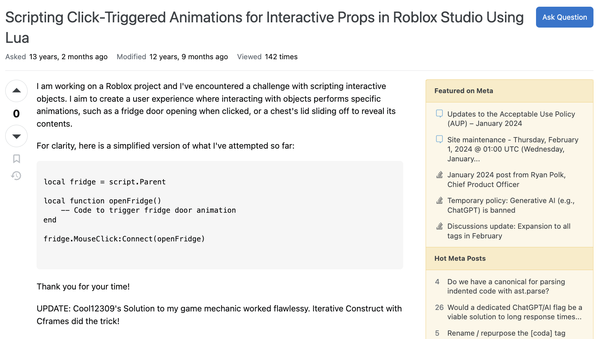

    

The nature of inquiry is quite a fascinating pursuit. We, by definition, are animals that explore and exploit information regarding everything and anything within the bounds of our senses. We seek the truth about everything. Such a process entails the manipulation and analysis of information received from the environment. Throughout history, we ask ourselves key-defining questions that progress our advancement in technology - How did the first invention of fire begin? How did the first scientist propose the idea of gravity? How did the first philosopher contemplate the nature of existence?

Alas,

*How did the first software engineer, after creating a bug, decide to call it a 'feature'?*

Fascinating as these inquiries entails, such reach is bounded by the nature of the inquiry itself. That is, our inquiries we purpose, often entails some sort of fundamental characteristics and methodologies used in seeking such information in any domain or phenomenon in the first place.

I remember when I first learned about programming, I would often send screenshots of my code and blabber on to my friends as to why this code is breaking the entire system! I would send memes as apart of my inquiry process, sending a sad cat picture as a direct call for help and a big blob of information represented as a screenshot of a vague code block, and assumed for a solution. Nevertheless, this was a time-critical question, as this very code block is due less than an hour!

Reflecting back, I suppose this is the typical pipeline that all beginner programmers face. The chaotic dance of navigating and handling the many n-th problems when engineering software systems. These little naunces like 'asking the right question' are often a big learning moment to being a competent software engineer. Nowadays, I am currently serving as a Software Engineer Research Content Developer, and apart of my process is to think of software systems as a very big complex system. And within that process, is to how inquiries are formulated, addressed, and resolved when engineering a system.

### The Social Etiquette of a Hacker

Akin to how scientific inquiry relies on empirical methods, observations, and experiments, and philosophical inquiry focuses more on logical reasoning and conceptual analysis. We, software engineers, have a rigorous methodology for crafting our nature of inquiries. One approach is grounded by the principles of ESR, or, should I say, the one and only, Eric Steven Raymond, a prominent programmer during the early days of CS, known for his literature work in software engineering and open source, The Cathedral and the Bazaar. He's quite well known within the CS lore and an exemplar that all aspiring software engineers should look up to. Throughout his experiences in software and collaboration, he proposes a series of premises of the nature of software engineering inquiries, or should ESR emphasize, *the social etiquette of a hacker*. ESR has full in-depth principles in his blog.  For a full analysis, see [How to Ask Questions The Smart Way](http://www.catb.org/esr/faqs/smart-questions.html).
Here, I attempt to compress key principles and properties directly into formulating an influential "smart" question.

#### The Methodological Approach of Inquiries for Software Engineers

1. **Meaningful, Specific Subject Headers:** Design descriptive and technical subject lines for clear engagement. You are enganging with community of domain-expertise and technical audiences, not a general audiences. Try be specific and direct as possible.

2. **Clear, Grammatical Language:** Write questions in well-structured, correct grammar. Hacker-lingo is appropiate, but be professional when converying a question to your best abilities.

3. **Accessible, Standard Formats:** Accessible, Standard Formats: Use standard, widely accessible formats for your queries. Try to strive for direct code blocks and not screenshots of your image. Try not to induce more artificial complexity for your reader.

4. **Be Precise and Informative:** Clearly and accurately describe your problem. ESR goes in depth to such design, but all questions and your attempts to solve such problem should be very detailed and descriptive.

5. **Volume is Not Precision:**  Be concise and focused rather than overly verbose. Don't send ~500 lines of code to your questions, only focus on the root cause of such code file. Which piece of code is causing such error?

6. **Don't Rush to Claim a Bug:** Avoid prematurely diagnosing issues as bugs. In any case, always assume that you are at fault, and not the system itself. Questions should be provoked after a thorough research.

7. **Avoid Grovelling:**  Be objective as possible. Merely state the facts in hand, and avoid presenting yourself as overly humble or self-deprecating. Focus on the task in hand.

8. **Describe Symptoms, Not Guesses:** Focus on what's happening, not on your interpretations. State the errors and factual information as observed. The interpretation happens with the community.

9. **Chronological Symptoms Description:** Present the issue in the order it occurred. Document the entire process, and go step by step to the point of error.

10. **Describe the Goal:** State your ultimate objective, not just the immediate step. Purpose a vision of how this particular problem fits into the bigger picture of the system you're creating.

11. **Be Explicit in Your Question:** Clarify exactly what you're asking. Avoid open-ended responses. Try to provoke leading questions that minimizes time commiment to readers.

12. **When Asking About Code:** Provide context and clarity when asking about code. Strive for a minimal bug-demostrating test case, that is, isolate the rest of your codebase, and provide the very code block that causes such error

13. **Don't Post Homework Questions:** Very straightforward. If the nature of such inquiry is directly tied to Academia (i.e, homeworks, exams, etc.), Seek hints, not solutions.

14. **Prune Pointless Queries:** Avoid unnecessary additions to your question (e.g, "Can anyone help me?") in the end of the question. State the problem via the principles outlined here and pray you'll get a response!

15. **Avoid "Urgent" Tags:**Don’t pressure the readers with urgency. Never formulate a question as a time-sensitive question.

16. **Courtesy Helps:**  Politeness can improve response quality. When in doubt, always end with a "Thank you for your time", to respect the time and effort the community is providing you with.

17. **Follow-Up on Solutions:** Share your solution and thanks to those who helped! Help contribute to the never-ending open source community ecosystem, and those who will encounter a smiliar situation as yours in the future.

Again, for a full detailed analysis and explantation per principles as outlined by ESR, see [How to Ask Questions The Smart Way](http://www.catb.org/esr/faqs/smart-questions.html). There's other principles ESR goes over beyond just the formulation of the inquiry, such as choosing the right community and various examples of "smart" and "not smart" questions, which is equally important for formulating a smart question as well.

### Concrete Examples

With our illustration of the key principles of outlined by ESR above, we will examine concrete examples, or real case studies, that are found within [Stackoverflow](https://stackoverflow.com/), a promiment open source community in which thousands of programmers and engineers-alike come to participate to the never ending cycle of open source software and hacker ecosystem!

#### Smart Question

**Link:** [Is iOS 12 on the iPhone X rendering OpenGL ES on top of Metal? And is there any way to avoid it?](https://stackoverflow.com/questions/55066901/is-ios-12-on-the-iphone-x-rendering-opengl-es-on-top-of-metal-and-is-there-any/55071394#55071394)

**Question:** The question at hand involves a programmer encountering issues while porting an old game engine to iOS and tvOS. Specifically, the game renders correctly on an iPad Air 2 and Apple TV, but not on an iPhone X.

    

**Why It's Smart:** This question aligns with its ESR's principles. There are many signals such as [1] Meaningful, Specific Subject Headers - The question targets a specific issue and system – rendering problems on different iOS devices. [2] Precision and Information - the query provides specific details about devices, OS versions, and observed behaviors. [10] Goal Description - The overall objective of solving the rendering issue is clear, as the programmer is porting a game engine to iOS and tvOS devices. Can you spot many more good signals as well?

    

The programmer even provided a follow-up solution to their problem in question! This satifies [17] Follow-Up on Solution. This component is proper hacker etiquette to help those who will face a smiliar situation as yours in the future, and to help contribute to the never-ending productive open-source ecosystem!

#### Not Smart Question

**Link:** [How do I program frames?](https://stackoverflow.com/questions/4295470/how-do-i-program-frames/4299985#4299985)

**Question:** The question at hand involves a programmer encountering issues with the Roblox Game Engine. It seems the programmer wants to implement a particular game mechanic but does not know what APIS to utilize within their respective game engine.

    

**Why It's not Smart:** This question its quite a contradiction to ESR's principles. There are many red flags such as [4] Be Precise and Informative - The question is not precise. It does not provide details about the programming environment, tools used, or the specific problem in the code. [8] Describe Symptoms, Not Guesses - The question doesn't describe symptoms or behaviors in a programming context, only a desired outcome. [11] Be Explicit in Your Question - the programmer doesn't provide details about what has been tried or what specific help is needed (i.e, What kind of frame are you referring too?), making it unclear. Can you spot many more red signals as well?

**Making It Smart:** With what we know about ERB's principles outlined above, we can then transform this not smart question into a smart question! See the newly transformed question below:

    

We went over the red flags we've analyzed from the original question, highlighted the contradictions as outlined by ERB's Smart Questions principles, and transformed this not-so-smart question into a very direct and clear question that technical readers can digest and solve smoothly. We've clarified the game engine and programming language in question for context, we've stated the overall objective of the problem (the author is enhancing user experience in his game), and provided a concise objective for the technical reader, as outlined by the imaginary code block. Notice the change of ambiguity and clarity between the former and ladder? The ladder provides a concise, straightforward and direct inquiry that is more productive to digest for our interested technical readers! We even provided a follow-up solution for our potential future readers, who will, one day, face the same problem as you have!

### Evaluation

We, software engineers, have a rigorous methodology for crafting our nature of inquiries. We tend to craft our inquiries to maximize productive output, akin to how scientist utilize their methodology to produce productive results, or how historians methodically analyze past events to understand and interpret our world, we too approach our software engineering problems with a structured and analytical mindset. By adopting established guidelines like those set forth by Eric S. Raymond, high-quality questions result in high-quality solutions, making us more pragmatic and productive when engineering software systems.

Note: ChatGPT assisted with the summarization of [How to Ask Questions The Smart Way](http://www.catb.org/esr/faqs/smart-questions.html) and the filteration process between smart and not-smart questions.
