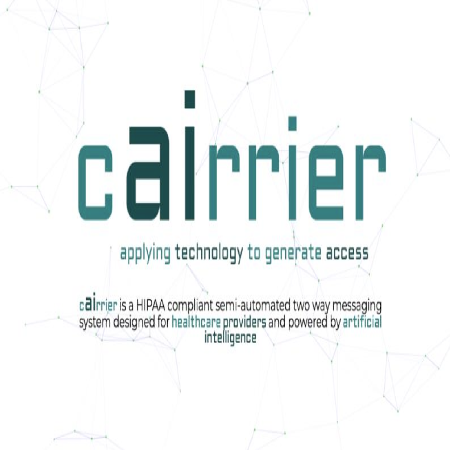
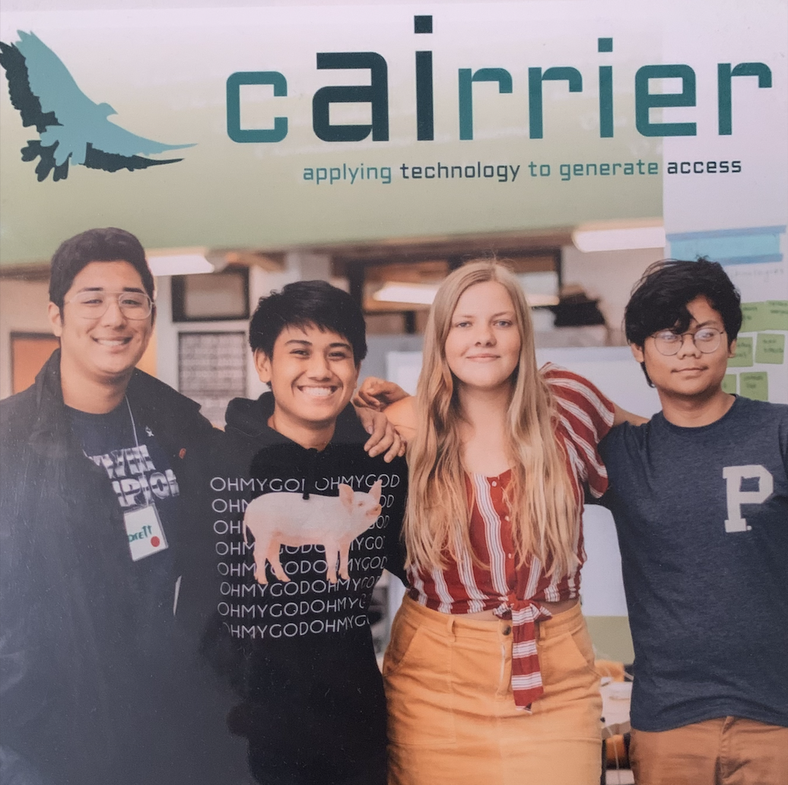

My fellow founders and I co-founded a NLP (Natural Language Processing) AI healthcare accessibility startup that connects patients with their healthcare providers in a simple intuitive manner that gained traction of over 1000+ unique visitors in a two-day time frame. We've orchested the concept and executed with a robust full stack application that allows users to communicate with their health care providers via a seemingless SMS and Web App pipeline. We've sstablished LEAN principles, rapidly launched a B2B SaaS product tailored for local healthcare providers, and participated in a pitch deck to 100+ people and healthcare companies. cairtext.com, built with [Node.js](https://nodejs.org/en/), [Firebase Firestore](https://firebase.google.com/docs/firestore), [Twilio](https://www.twilio.com/en-us), and deployed to [Firebase Hosting](https://firebase.google.com/docs/hosting).

  

I served as the technical co-founder of our startup, where I was the lead engineer that orchestrated the live web services for this startup. I was responsible of leading my other fellow technical co-founder to build and launch cairtext.com into the interwebs, and injecting data analytics and signs ups for potential users of our targeted market. I've designed and implemented our semi-automated two way messaging system for healthcare providers and envision its implementation with artificial intelligence in the communication pipeline.

As we believed a messaging platform that can be trustworthy, intuitive, confidential, and easily customizable to meet the specific needs of your practice.

During this experience, I learned the naunces of being within the tech startup ecosystem. It is the result of naturally having a problem within your field of work, and designign a solution to such problem, and figuring out a business model of that solution. As a technical co-founder, I've often have to translate our software system to the general audiences, allowing the understandment of our vision. I learned how to accumlate a mass of users, and market software correctly.

View Source On Github: <a href="https://github.com/caslabs/cAIrrier">cairtext</a>
