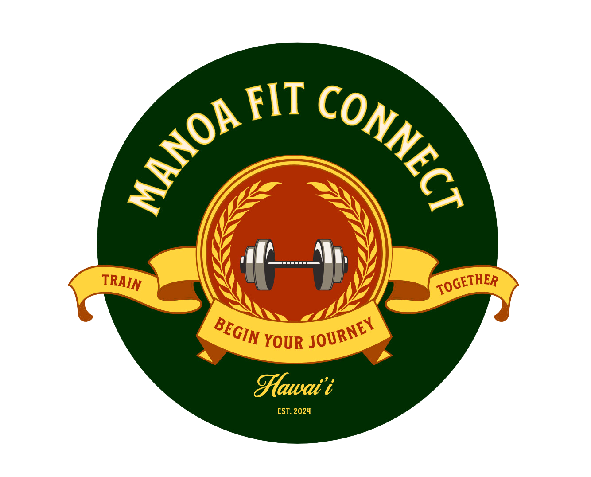

  

Manoa Fit Connect, a pioneering gym connectivity platform tailored for University of Hawaii at Manoa students. Developed using [MongoDB](https://www.mongodb.com/), [Meteor](https://www.meteor.com/), and [React](https://reactjs.org/) for a dynamic user experience, deployed as a full-stack application accessible via web browsers. Visit our project: [Manoa Fit Connect](http://manoafitconnect.com)

My colleagues and I co-founded a pioneering gym connectivity platform, Manoa Fit Connect, specifically tailored to address the challenges faced by University of Hawaii at Manoa (UHM) students at the gym. Within a short period of Upon launching, our platform experienced rapid adoption, driven by its robust technical framework. Utilizing MongoDB for efficient data handling, and Meteor for seamless real-time communication, the application supported a dynamic front-end experience that effectively streamlined interactions among users. . We developed an intuitive full-stack application that not only facilitates seamless interactions between gym-goers but also showcases Manoa's gym equipment and routines, making fitness more accessible and enjoyable.

We believe that integrating fitness into the academic lifestyle at the University of Hawaii at Manoa is not just beneficial, but essential for student success. At Manoa Fit Connect, we are dedicated to revolutionizing the way students engage with physical wellness by providing a platform that is deeply integrated into their daily routine.

 Our mission is rooted in the conviction that regular exercise significantly enhances mental clarity, reduces stress, and improves overall well-being, thereby improving academic performance and personal growth of UH MANOA students. By aligning our technology with the needs and habits for UHM community, we are motivated to make health and fitness an accessible, integral part of the student experience.

### A Social Experience

As a co-developer, I played a crucial role in developing the live web services. My responsibilities included leading a dedicated team of fellow engineers in engineering the robust platform, which now supports dynamic user interactions and community engagement through features like our buddy system. Additionally, I've engineered a profile system that lists all of our users in our app, enhancing the community feel and making it easier for members to connect and engage with one another.

  

For our minimum viable product, we introduced a feature-rich interface that allowed users to connect with potential gym partners, learn about various workout routines, and navigate gym equipment with ease. Our platform was envisioned during a time when digital fitness solutions were just beginning to gain traction, providing us with the unique opportunity to lead with innovation in a tech-driven fitness environment.

  

Our co-member, deeply passionate about making fitness a less intimidating experience, was driven by his personal struggles with gym environments. He envisioned a platform where every student, regardless of their fitness level, could feel confident and supported. This vision was crucial in shaping our platform's development, focusing on community building and user-friendly design.

Throughout this journey, we have learned invaluable lessons about team dynamics, particularly. It has been a process of constant learning, from ideating and creating a user-centric product to effectively marketing it to the target audience. We've also focused on gathering user feedback continuously, which has been instrumental in refining and enhancing the platform.

During a short time frame, We've successfully created a space that supports UHM students in their fitness journeys and also fosters a strong sense of community. Our vision of making gym experiences more accessible, less intimidating, and socially enriching for everyone involved has always been our objective. We are a team of innovators committed to improving student life through technology.
