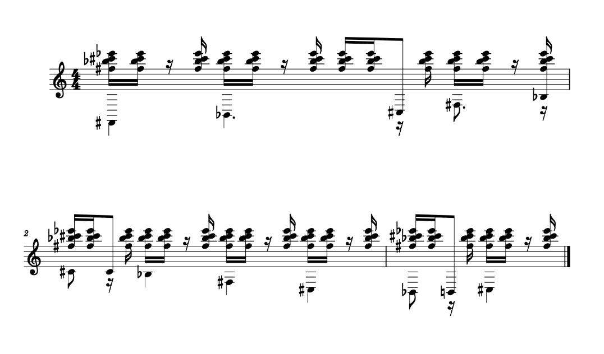

I was apart of AI4ALL 2023 Cohort, an initiative aimed at fostering diversity and inclusion in the rapidly evolving field of artificial intelligence. Founded with the vision of creating a future where AI is shaped by a diverse range of perspectives, AI4ALL equips young people from underrepresented groups with the education and tools necessary to succeed in AI. Founded in 2017 by Dr. Fei-Fei Li, Dr. Olga Russakovsky, and others, with a mission to increase diversity and inclusion in the field of artificial intelligence (AI). The organization’s emphasis on ethical AI development and its approach to AI as a tool for social good make it a significant stepping stone for students aiming to make an impactful change in the world.

For our AI4ALL cohort program, my colleagues and mentor orchestrated a Music Transformer AI system, aimed at generating music using deep learning techniques. The generative AI project is built upon a transformer-based architecture for musical generation and is trained on the Maestro v3 dataset. We have also programmed a series of supplementary Jupyter notebooks to provide an in-depth understanding of our thought process and methodology to how we can generate music using natural language processing methodologies. We've implemented the Transformer-XL architecture that treated music generation as a language problem, where we perceive musical notes as a natural language, to which we can predict the next sequence of words to generate a musical piece.

I was the lead programmer who orchestrated the music-generating AI. Along with my mentor and colleagues, we discussed in-depth the machine learning workflow, from data sourcing to data exploration, and feature engineering and engineering our model. We designed a model that handles MIDI data and generates new music based on patterns from the Maestro V3 dataset, an open-source dataset that includes various composers and their musical pieces. I also orchestrated the data visualization and analysis component of our project, to which we presented our findings to our cohort community and AI industry folks.

## Data Exploration
### Composer Distribution

>

To provide a clearer picture of the data's composition, we constructed a bar chart detailing the number of MIDI files per composer. This visual representation is not just a mere statistic; it's a crucial analytical tool that allows us to identify potential biases in the dataset.  The chart helps us see which composers are underrepresented, guiding us to make informed decisions about how to enhance the diversity of our dataset.

## Feature Engineering

>

Our framework utilizes a specialized encoding scheme to convert MIDI data into a format suitable for a transformer model. This process begins with the MIDI data being translated into a sequence of "events," which encapsulate various musical actions such as note activations/deactivations, pitch bends, and instrument changes. Each of these events is then assigned a unique token ID based on a predefined vocabulary, effectively transforming them into tokens. These tokens are subsequently embedded into continuous vector spaces via a learned embedding layer, which facilitates their processing by the transformer model's encoder layer. This encoder transforms the token embeddings into a series of hidden representations, which the decoder layer uses to generate the output sequence. To ensure consistency, the output sequence's token IDs are converted back into MIDI events, mirroring the original format of the input data. By standardizing the vocabulary and encoding process, the MusicAutobot library streamlines the preparation of MIDI data for use in transformer models, enhancing both efficiency and compatibility.

## Machine Learning Theory

### Model Design

>

The TransformerXL architecture is used to model the structure of music more effectively, particularly for capturing long-range dependencies in musical pieces. The recurrence mechanism and relative positional encoding in TransformerXL allow the model to learn and generate music with a better understanding of the relationships between different parts of a musical piece.

## Predictive Modeling

### MIDI to Musical Note Conversation

>

Here, we demostrated how to generate MIDI files using a pre-trained model. The output of the notebook is a MIDI file that can be played back using an external software synthesizer or converted to an audio file using tools like Music21 or FluidSynth.

Throughout this process, I learned about generative AI, and its pros and cons currently as 2023-2024. I learned more about collaborating with a team and also asking the right questions to our mentor, who had experience in industry AI, hailing as a senior machine learning engineer. Since this was our first generative AI project, I've learned more about deep learning architectures that power modern GPT systems, and how expensive such experiments are often conducted.

View Source On Github: <a href="https://github.com/caslabs/music-generation"><i class="large github icon "></i>Music Generating Transformer</a>
