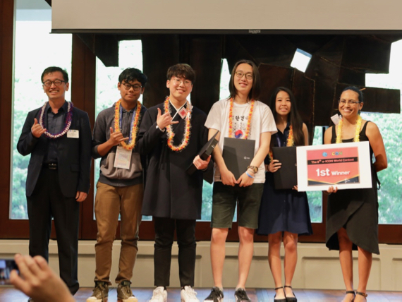

**A joint South Korea-USA team takes top prize at 8th e-ICON World Contest for the development of a brilliant augmented reality app.  The e-ICON contest brought teams together from all over the world to participate, challenging students to create educational mobile apps as tools to achieve United Nations' Sustainable Development Goals**

## Augmented Reality Based Education

Augmented Sciences, an Augmented Reality based education app, developed for Androids phones. Built with [Unity Studio](https://unity.com/), [Vuforia](https://www.ptc.com/en/products/vuforia), deployed to [Android Play Store](https://play.google.com/store/apps?hl=en_US&gl=US).

View our [newsworthy winning article](https://www.hawaiipublicschools.org/ConnectWithUs/MediaRoom/PressReleases/Pages/8th-e-ICON-winners.aspx)

I was apart of the 8th e-ICON contest, which stands for e-learning International Contest of Outstanding New Ages, a challenge curated by the South Korean Educational system, which brought teams together from all over the world to participate including those from Australia, Korea, Indonesia, Japan, Mexico, Spain and the United States. I represented team USA, including other known colleagues that also represented our nation. The contest challenged students to create educational mobile apps as tools to achieve Sustainable Development Goals adopted by the United Nations, and there a series of judges critiquing our application based on quality, usability, and completeness. Throughout our competition, our team designed and implemented an innovative educational tool, offering scalable and cost effective way to teach kids from developing countries to be inspired by sciences through augmented reality. Hence, a new era of learning.

Yep. When I first read that very statement, I was genuinely terrified to the core! Why was I, a social anxious seventeen year old, who failed and embarassed his previous hackathon experience, was picked to represent an international competition of a much larger and serious hackathon experience!!! I had a serious imposter syndrome moment seeing all my competitors for the first time, highly trained and serious on winning. Some hailed in private institutions, some where competitors to the core, and anamolies like me - who just wanted to make new friends. It turns out, I was the team lead and project manager for this competition that resulted on becoming an international winner.

I orchestrated the entire idea of the use of Augmented Reality and Education, offering innovative learning experiences while also factoring resource contraints that developing countries are facing. During this process, I've commandeered our team to envisioning the product, collaborating with my south korean colleagues to build and design our product in a timely manner. There were often times where I pair program along with the main coders to debug various aspects of the codebase including the implementation of the game mechanics, which involves physical simulations of a solar system model, and chemical reactions. There also exist a severe language barrier, often times, our team would constantly be communicating through google translate between English and Korean. Diffucult as it was, I found this as a friendhip bonding process. Besides contributing the technical aspects of this project, I've spearheaded the marketing and pitch of our product, resulting an award in best in pitch and presentations, which we presented our product to ~100-200 people on stage, to educators and competitors alike.

Throughout this gruelling process, I learned more about emphasis of execution from an idea. There were projects that my competitors have built that had great idea, but failed the execution part of the competition. Usually for a great execution, one must have a great team to orchestrate that process. This involves an alignment of vision and understanding your team members, and let them do the part of which they are madly passionate about.

View Source On Github: <a href="https://github.com/caslabs/8th-E-Icon">Augmented Science</a>
